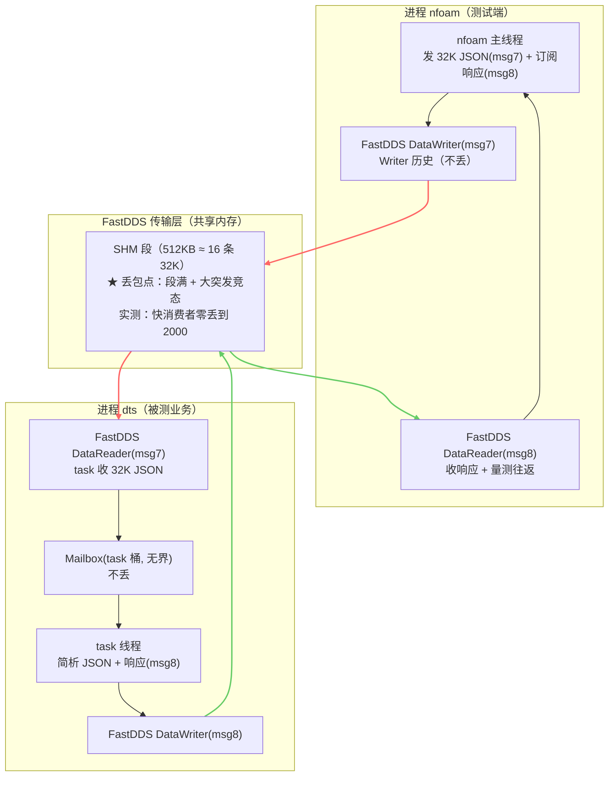
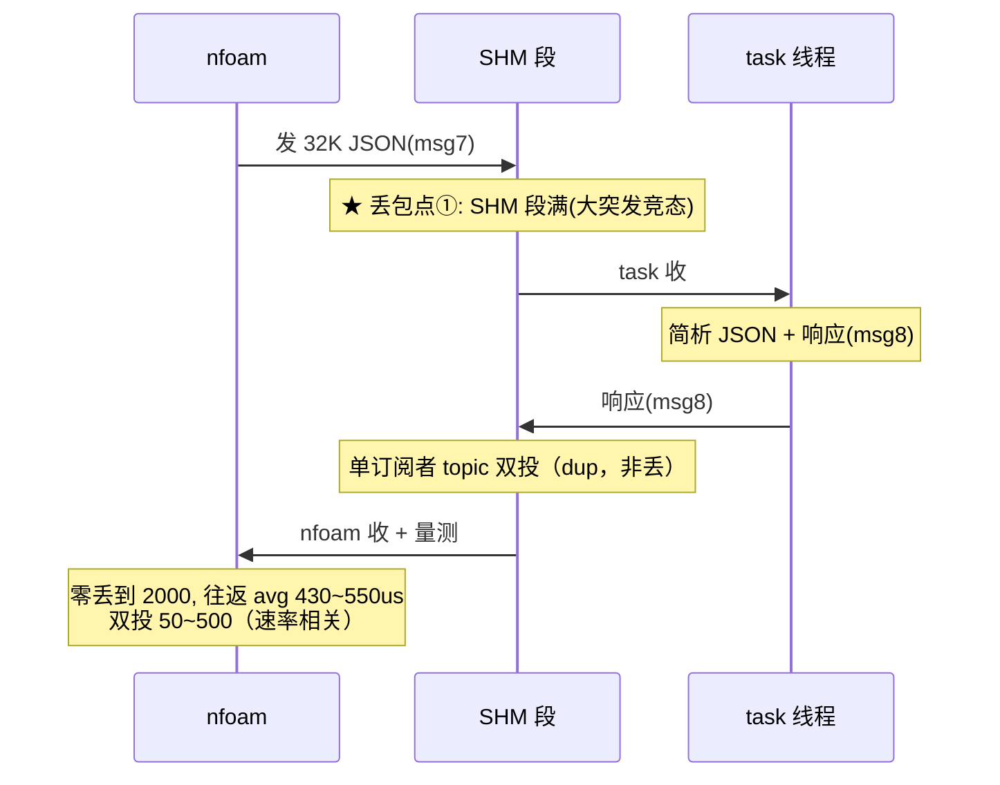
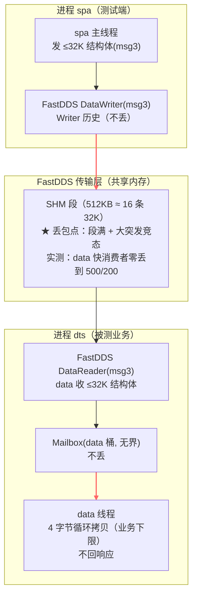
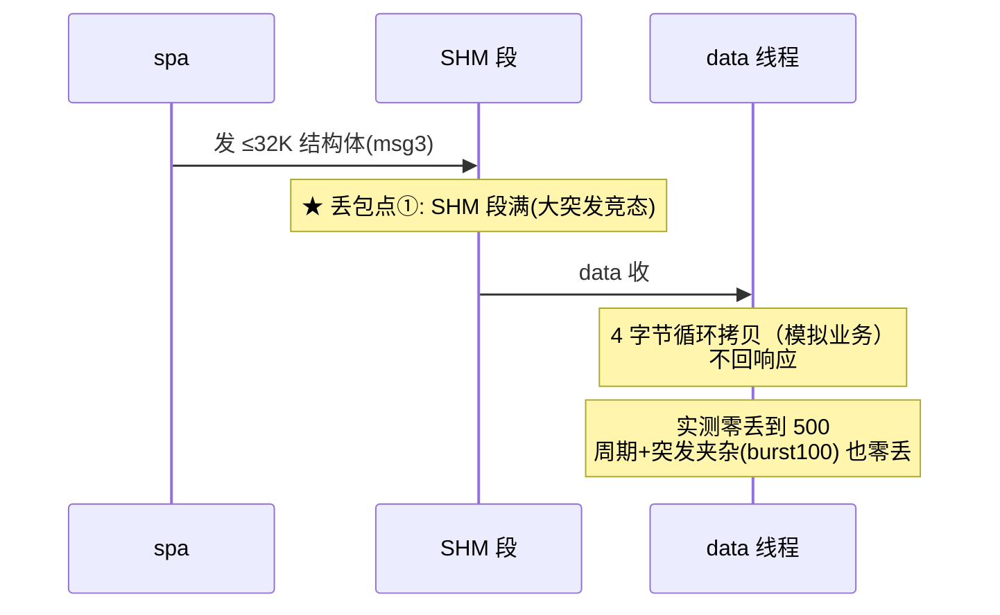

# DDS 链路基准 + 丢包分层（task / data 独立基准，2026-08-03）

> 两个独立基准：**A. task 双向收发**（nfoam ↔ task）、**B. data 单向接收**（spa → data）。
> 每基准 2 张图（部署图 + 流程图，共 4 张，箭头配色区分收发）。测试结果表 + 图 + 丢包定位放一起。

---

## 1. 测试报告

### 1.1 task 双向收发（nfoam 发 32K JSON → task 简析 + 响应 → nfoam 收）

| 发送数 | 速率 | 响应 | 丢包 | 双投 | 往返avg(us) | 往返p99 |
|---|---|---|---|---|---|---|
| 50 | 紧突发 | 50 | 0 | 50 | 847 | 1471 |
| 50 | 1ms | 50 | 0 | 50 | 565 | 924 |
| 50 | 10ms | 50 | 0 | 50 | 1371 | 2239 |
| 50 | 100ms | 50 | 0 | 50 | 2261 | 2880 |
| 100 | 紧突发 | 100 | 0 | 22 | 1186 | 3297 |
| 100 | 1ms | 100 | 0 | 100 | 492 | 722 |
| 100 | 10ms | 100 | 0 | 100 | 1172 | 2005 |
| 100 | 100ms | 100 | 0 | 100 | 2249 | 2792 |
| 200 | 紧突发 | 200 | 0 | 200 | 875 | 2302 |
| 200 | 1ms | 200 | 0 | 200 | 498 | 842 |
| 200 | 10ms | 200 | 0 | 200 | 1322 | 2026 |
| 200 | 100ms | 200 | 0 | 200 | 2231 | 3018 |
| 1000 / 2000 | 紧突发/1ms | 全收 | 0 | - | 430~518 | - |

**>64 变更场景**：零丢（task 消费够快，可靠背压生效）。

### 1.2 data 单向接收（spa 发 ≤32K 结构体 → data 4 字节拷贝，不回响应）

| 发送数 | 速率 | data 收 | 丢包 |
|---|---|---|---|
| 50 | 紧突发 / 1ms / 5ms | 全收 | 0 |
| 200 | 紧突发 / 1ms / 5ms | 全收 | 0 |
| 500 | 紧突发 / 1ms / 5ms | 全收 | 0 |

### 1.3 data 周期 + 突发夹杂（datamix，burst 注入周期流）

| 周期 | burst | 总发 | 收 | 丢 |
|---|---|---|---|---|
| 5ms | 20 | 251 | 251 | 0 |
| 10ms | 20 | 251 | 251 | 0 |
| 5ms | 50 | 551 | 551 | 0 |
| 10ms | 50 | 551 | 551 | 0 |
| 5ms | 100 | 1051 | 1051 | 0 |
| 10ms | 100 | 1051 | 1051 | 0 |

### 1.4 32K 紧突发丢包临界点（task msg1 路径）

| count | task reader 收 | 结论 |
|---|---|---|
| ≤70 | 全收 | **稳定零丢** |
| 80 | 1/81 | **间歇近全丢** |
| 90 | 全收 | 间歇（时好时坏） |
| 100+ | 1-3/101 | **间歇近全丢** |

**触发条件**：紧突发 + 32K + count≥~80 三者叠加；周期 ≥500us 零丢；小包零丢；**非消费者速度**（slow 2000× 仍零丢）；**topic 特定**（data msg3 路径 count=200 仍零丢）。

### 1.5 M 级消息（1MB+）

- **1MB 单条收不到**（SHM 512KB < 1MB，分片也溢出）
- **10M 当前配置不可行**：需 SHM 段放大（自定义 SHM 崩）+ 类型上限 + 分片支持

---

## 2. 基准 A：task 双向收发（nfoam ↔ task）

### A-1. 部署图（线程级 + 组件 + 丢包点，红=发送 / 绿=响应）

### A-2. 业务流程图（丢包位置）

---

## 3. 基准 B：data 单向接收（spa → data）

### B-1. 部署图（线程级 + 组件 + 丢包点，红=发送）

### B-2. 业务流程图（丢包位置）

---

## 4. 丢包归属汇总

| 层/组件 | 是否丢 | 触发条件 |
|---|---|---|
| DataWriter 历史 | ❌ | write_fail=0 |
| **SHM 段 512KB** | ✅ | **紧突发 + 32K + count≥80**（间歇） |
| Mailbox 桶（无界） | ❌ | 排空 + 无界 |
| 业务线程 | ❌ | 按序消费 |
| 单订阅者响应 topic | ⚠️ | 双投（重复上报，非丢） |
| task 业务封顶 kMaxTasks=64 | ⚠️ | 建任务数 >64（业务规则） |

**结论**：真实业务（1s 周期 data + 阶段性 task 配置变更）在稳定区（非紧突发 ≥80 条 32K）→ 不触发。M 级消息是另一个量级，需升级/自研。
