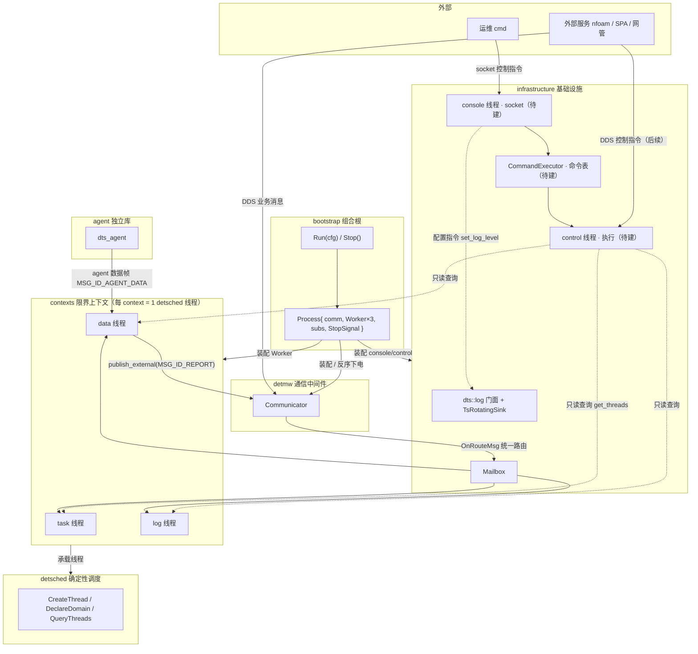

# DTS 总体架构设计（子系统接口契约 v1）

> 日期：2026-08-05 · 用途：**跨 claude-code 窗口的接口基准**。
> console / data 各开独立窗口实现，窗口输入 = 本文档对应章节 + 代码现状（bootstrap 已落地）。
> 依据：docs/design/dts-strategy.md（D1-D10）、contracts/ 五份、代码现状。

## 1. 分层与总体架构图



**依赖方向**：`detsched ← infrastructure ← contexts ← bootstrap`；`detmw ← infrastructure`；`agent` 独立（联编）。
**进程结构**：单进程多线程。业务线程 task/data/log + 运维线程 console/control，全部经 detsched 承载。

## 2. 进程级接口（bootstrap/include/run.h）✅ 已落地

```cpp
namespace dts {
// 进程运行（组合根）：装配 detmw + 业务线程 + console/control，常驻阻塞直到 Stop() 后下电。
// 返回 0 正常退出；非 0 装配失败（detmw init=2 / 线程装配=3）。进程生命周期内仅执行一次。
int  Run(const char* cfg_path);
// 请求停止：信号回调 / 测试线程调用。
void Stop();
}
```

## 3. detmw 接口（thirdparty/detmw/include/detmw.h）✅ 已落地

```cpp
namespace detmw {
struct endpoint { std::string session_type, session_inst; uint32_t msg_id; /* ==/ToString */ };
using recv_fn = void (*)(void* user_ctx, const uint8_t* data, uint32_t len);

class Communicator {
public:
    explicit Communicator(const char* cfg_path);
    ~Communicator();
    int  subscribe(const endpoint& src, recv_fn fn, void* ctx);                    // 收：建 reader + 注册回调
    int  publish_external(const endpoint& dst, const uint8_t* data, uint32_t len); // 发（进程外 DDS）
    int  publish_internal(const endpoint& dst, const uint8_t* data, uint32_t len); // 发（进程内，当前走 transport 过渡）
    bool good() const;        // 装配状态：cfg 解析 + participant 起立
};
}
```

**接收统一路由（契约 detmw.md §3）**：无论 external/internal，目标线程都经订阅回调（bootstrap 的 `OnRouteMsg`）进 mailbox，全系统唯一投递点；mailbox 直通只允许是 transport 内部优化，业务代码不得旁路回调。

## 4. infrastructure 接口

### 4.1 日志（include/log.h）✅ 已落地

```cpp
namespace dts::log {
enum class Level { TRACE, DEBUG, INFO, WARN, ERROR, CRITICAL };
struct Config { /* poolSize / poolThreads / level / console / file{enable,dir,namePattern,maxSizeMb,maxTotalMb} */ };
int  Init(const Config& cfg = {});   // 幂等
void Shutdown();
void SetLevel(Level lvl);  Level GetLevel();
template<typename... Args> void Info/Warn/Error/Debug/Trace(format_string, Args...);
}
```

### 4.2 控制面（console / control / CommandExecutor）✅ **已落地 2026-08-05**

> 实现：`dts::ctl`（include/ctl.h + src/ctl.cpp）+ console/control（include/console.h + src/console.cpp）。
> 接口按下方契约落地，内置 help/get_threads/set_log_level，bootstrap Process 装配起停。

**文件规划**：`infrastructure/console/`（socket 监听）+ `infrastructure/control/`（执行线程）+ `infrastructure/ctl/`（命令注册表）。

**命令表（contracts/infrastructure.md §2，核心复用点）**：

```cpp
namespace dts::ctl {

struct Command {
    const char* name;                 // "set_log_level" / "get_threads"
    const char* usage;                // 用法提示
    int (*fn)(const std::vector<std::string>& args, std::string& out);  // 执行：0 成功
};

class CommandRegistry {               // 进程内单例，命令集中登记
public:
    static CommandRegistry& Instance();
    int  Register(const Command& cmd);          // 重名返回非 0
    const Command* Find(const char* name) const;
    void ForEach(const std::function<void(const Command&)>& fn) const;  // help 遍历
};

int Execute(const std::string& line, std::string& out);  // "name arg1 arg2" -> 查表 -> 执行

}
```

**运维线程（contracts/infrastructure.md §3）**：

```cpp
namespace dts {
// console：socket 监听线程（人类 cmd 入口）。AF_UNIX，行协议：一行一条命令，响应回写。
// 只翻译（socket -> ctl::Execute 投递），不执行命令。低优先级（SCHED_OTHER，不绑 RT）。
int console_start(const char* sock_path);   // 0 成功
void console_stop();
// control：运维指令执行线程。消费 console 投递的命令 -> ctl::Execute。
// 只读查询各业务线程（detsched::QueryThreads），不阻塞业务。低优先级。
int control_start();
void control_stop();
}
```

**console → control 传递**：线程安全命令队列（单生产者单消费者即可；命令量低频）。

**内置命令（首批）**：
- `help`：`CommandRegistry::ForEach` 列全部命令 + usage
- `get_threads`：`detsched::QueryThreads(ThreadInfo*, cap)` 全进程线程注册表，格式化输出
- `set_log_level <trace|debug|info|warn|error>`：`dts::log::SetLevel`（D6 线程安全接口，不加锁）

**bootstrap 装配位置**：`Process` 增加 console/control 起停；`Run` 装配顺序 = 日志 → detmw → 业务线程 → **console/control**；下电反序 = **console/control 先停** → 业务线程 → comm → 日志。

## 5. contexts 接口

### 5.1 线程入口统一形态（interface，三级路由业务组消息表驱动）✅

```cpp
namespace dts {
// 每 context 一个 detsched 线程；ThreadCtx.m_mailbox 收消息，ThreadRun 消费后调入口。
// 路由语义：sessionType 线程内固定（"DTS"）；sessionInst = 业务组（线程可挂多组，
// mailbox 消息携带）；msgId = 组内具体业务（msg_table.h：FindSessionTable 选组 →
// 组内 {msgId, func(void* data, uint32_t len)} 查表），一行一消息流，
// 新增业务流程 = 组内表加一行（见 {task|data|log}_msg_handler.cpp）。
using EntryFn = void (*)(ThreadStatus status, const char* sessionInst, uint32_t msgId,
                         void* msg, uint32_t len);
void TaskEntry(ThreadStatus, const char*, uint32_t, void*, uint32_t);
void DataEntry(ThreadStatus, const char*, uint32_t, void*, uint32_t);
void LogEntry(ThreadStatus, const char*, uint32_t, void*, uint32_t);
}
```
约束：entry 只转发；业务在 application（`*MsgHandlerDispatch` 按 sessionInst 选组 →
组内按 msgId 直分）。线程本地消息（MSG_ID_TIMER）不属业务组。

### 5.2 data 子系统接口边界（预留接口 + 契约）⚠️ **内部待 ISO 重设计 ← data 窗口输入**

> data 窗口只消费本节（预留接口 + 契约），其余（内部机制/数据模型）按 ISO 流程重新设计，
> 不依赖本文档其它章节。窗口启动读 [docs/CONTEXT-data.md](../CONTEXT-data.md)。

**消息契约**（msgId 在 (sessionType, sessionInst) 内唯一）：
```
MSG_ID_DATA_TASK_ACTIVE  0x0002  task -> data（进程内，TdMap 跟踪 taskId↔dataId）
MSG_ID_AGENT_DATA        0x0003  agent -> data（SPA 帧，带 BigFrameHeader/DataType）
MSG_ID_REPORT            0x0004  data -> 网管（1s 定时上报）
```

**data 线程链路（现状）**：
```
OnRouteMsg → data mailbox → ThreadRun → DataEntry → DataMsgHandlerDispatch
   ├─ TASK_ACTIVE → TdMap.Track(taskId, dataIds)
   └─ AGENT_DATA  → DataFactory.Feed(帧) → 按 DataType 匹配 dataId → DataConstruct(Extra→Hton→Report) → ReportCache
DataMsgHandlerTimerReport()（1s）→ ReportCache.TakeAll() → publish_external(REPORT)
```

**现状 domain 接口（骨架，允许重写）**：
```cpp
namespace dts {
class TdMap {           // taskId↔dataId 多对多，data 线程独占无锁
    void Track(uint16_t taskId, const std::vector<uint16_t>& dataIds);
    void Untrack(uint16_t taskId);
    std::vector<uint16_t> TasksOf(uint16_t dataId) const;
    std::vector<uint16_t> DataIdsOf(uint16_t taskId) const;
    bool IsTracked(uint16_t dataId) const;
};
class ReportCache {     // 每 task 独立缓存，1s TakeAll
    void Append(uint16_t taskId, const uint8_t* data, uint32_t len);
    std::vector<ReportBlock> TakeAll();
};
class DataFactory {
    static DataFactory& Instance();
    void RegisterProcessor(uint16_t dataId, uint16_t dataType,
                           std::unique_ptr<DataConstruct> proc, uint32_t tempOffset, uint32_t structSize);
    DataFeedStat Feed(char* data, uint32_t len, const TdMap& tdmap, ReportCache& report);
};
class DataConstruct {   // 加工基类：模板方法 Process
    virtual int Extra(char* raw, char* dest) = 0;   // 拆分
    virtual int Hton() = 0;                         // 字节序
protected:
    int Report(uint16_t taskId, uint32_t len);      // 临时缓存 -> ReportCache
};
void DataDomainInit();   // 注册全部 dataId 加工子类
}
```

**边界约束（ISO 重设计时不变式）**：
- data 线程独占所有 domain 对象，无锁（pub-sub 保障串行）
- domain 零技术依赖：不 include detmw/detsched/infrastructure，收发走 `dts::port::MwPort`（contracts/contexts.md §2）
- 上报协议：`ReportHeader{taskId, timestampMs, seq, payloadLen}` + payload，1s 批量
- 对外输出唯一经 `publish_external(REPORT)`

## 6. detsched 接口（thirdparty/detsched/include/thread_api.h）✅

```cpp
namespace detsched {
using ThreadHandle = struct ThreadHandleImpl*;
bool DeclareDomain(int prioLevel);
ThreadHandle CreateThread(const std::string& name, int prioLevel, ThreadFn fn, void* arg);
void DestroyThread(ThreadHandle h);
size_t QueryThreads(ThreadInfo* out, size_t cap);   // control 只读查询用
void   DumpThreadInfo();
}
```

## 7. agent 接口（agent/include/dts_agent/dts_agent_api.h）✅

```cpp
namespace dts {
using AgentHandle = struct AgentImpl*;
AgentHandle dts_agent_create(const AgentCfg* cfg);  // 起读线程（乒乓 -> 回调 publish）
void dts_agent_destroy(AgentHandle h);
}
```

## 8. 跨窗口约束（各窗口实现时必须遵守）

1. **接收统一入口**：任何消息进线程都经 OnRouteMsg → mailbox，不得旁路（契约 detmw.md §3）
2. **domain 纯度**：domain 零技术依赖，走 `dts::port` 端口（contracts/contexts.md §2）
3. **线程独占无锁**：每业务线程的 domain 对象线程内独占，不加锁
4. **日志**：一律 `dts::log::Xxx`，不直接调 spdlog
5. **函数入参 ≤5**、`const T&`、C++17、零 warning（-Werror）

## 9. 窗口划分与启动

| 窗口 | 启动入口 | 输出 |
|---|---|---|
| **console 窗口** | ✅ 已落地 2026-08-05（[CONTEXT-console.md](../CONTEXT-console.md) 记完成） | `dts::ctl` 命令表 + `console`/`control` 线程 + bootstrap 装配，内置 help/get_threads/set_log_level |
| **data 窗口**（下一阶段） | [docs/CONTEXT-data.md](../CONTEXT-data.md) + contracts/contexts.md | data 子系统 ISO 重设计 + 数据工厂扩展（内部架构可重写） |
**两份栈备忘录已自包含**：接口契约摘要 + 项目现状 + 流程 + 验证命令 + 完成标志，新窗口只读自己的备忘录即可启动，除契约外不依赖本文档。
