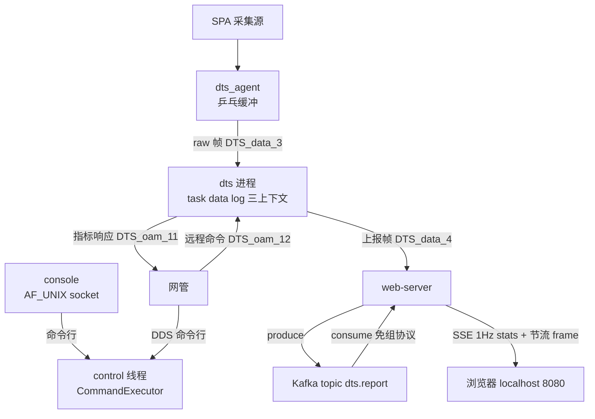

# DTS：5G 基站数据采集中间件 · 技术全览

> 版本：v1 · 2026-09-08 · 定位：项目综合叙述（新读者入口，替代翻散落的 worklog/设计文档）
>
> 关联：[dts-strategy.md](dts-strategy.md)（D1-D10 决策）· [dts-architecture.md](dts-architecture.md) · 六份 [contracts/](../../contracts/)
>
> 一句话：在 5 毫秒的单帧处理预算和 1000 帧/秒的持续负载下，把基站侧测量数据**确定性地**采集、切分、聚合，
> 沉淀到网管/Kafka——并且每一步的丢失、超时、降级都**有数可查、拒绝静默**。

## 1. 总体架构

### 1.1 端到端数据流



- 观测即验证沉淀：web 页面显示的是从 Kafka 消费回读的数据——页面有数 = Kafka 里真有
- 命令一处定义、两条传输（D3）：socket 与 DDS 殊途同归到 control 线程执行，运维不进业务热路径（D5）

### 1.2 分层

```
┌────────────────────────────────────────────────────────────────┐
│ 观测面   web-server：Kafka 沉淀 + SSE 浏览器实时观测              │
│ 运维面   console(socket) / OAM 远程通道(DDS) → control 执行线程   │
├────────────────────────────────────────────────────────────────┤
│ 业务上下文  task │ data(切分/聚合/上报) │ log      ← 各自限界上下文 │
├────────────────────────────────────────────────────────────────┤
│ 组合根  bootstrap/run.cpp：装配 Worker×3 + 订阅 + 生命周期 Run/Stop │
├────────────────────────────────────────────────────────────────┤
│ 基础设施  mailbox(零拷贝) │ ThreadRun(绝对期限节拍) │ 日志门面 │ 定时轮 │
├────────────────────────────────────────────────────────────────┤
│ 通信中间件 detmw：endpoint 统一寻址 + TransportInterface 隔离      │
│           ├ FastDDS(默认) ├ 自研桶传输(SHM 环) ┄ 定长 plain 零拷贝 │
├────────────────────────────────────────────────────────────────┤
│ 确定性调度 detsched：RT 优先级域 / BKG 域 / 线程注册表              │
└────────────────────────────────────────────────────────────────┘
```

最核心的一条架构决策：**业务代码永远不直接碰 FastDDS**。所有跨进程通信收敛到
`detmw::Communicator`，底层传输被 `TransportInterface` 隔离——后来"换掉 FastDDS 内置
SHM 传输"只动一个适配层，业务零感知，兑现了这个决策的全部价值。

### 1.3 三级消息路由与双 API

- 寻址：`sessionType`（进程内固定）→ `sessionInst`（业务组，线程可挂多组）→ `msgId`（组内
  表驱动，一行一个消息流）；编译期护栏查重。**路由是数据，不是代码分支**
- 双 API：`publish_internal`（本进程订阅者 mailbox 直通，免序列化）/ `publish_external`
  （进程外 DDS）。进程内与进程间是两个问题，不假装成一个 API

## 2. 子系统设计

### 2.1 detmw：通信中间件

- endpoint 三元组即地址，映射 topic（如 `DTS_data_4`），自带 ==/hash/ToString
- 类型系统：缺省 BytesType（变长）；配置 `plain_size` 切 FixedBytesType（定长 plain，
  DataSharing loan 零拷贝候选）——**类型选择是配置不是代码**
- 配置驱动 codegen：gen_detmw.py 从 json 生成线程路由头 + 静态发现 XML + 进程配置
- 环境自适应开关族：`DETMW_BUCKET`（桶传输+fail-fast）/ `DETMW_UDP_MTU`（RTPS 层分片，
  绕开 IP 分片不可达环境）/ `DETMW_LOCAL_PEERS`（免组播发现）/ `DETMW_QOS_*`（性能扫描）
  ——同一二进制适配从 CI 沙箱到目标硬件

### 2.2 桶传输（自研 SHM 环）

绕开 FastDDS 内置 SHM 两个死结（段容量 512KB 上限 + 上游未修析构 UAF）：POSIX shm 定长环 +
futex 唤醒 + robust mutex 多写互斥 + 崩溃残留接管（ClaimOwnership）。实测 200×32K 零丢、
~325MB/s（2 拷贝版）。它也贡献了本项目最贵的一课（§5）。

### 2.3 data 上下文：采集中枢

500 cell × 500 dataId 矩阵按规格表切切片（4-200B，seed 固定可复现）；TdMapV2 管测量对象
缓存块与激活集；ReportAggregator 聚合上报（48K 上限，超容计数不静默）经 `ReportSink` 抽象
出口——**换上报目标 = 换注入的 sink**，web/网管互不感知。

### 2.4 运维面与观测面

- console（人类，AF_UNIX + dts-cli.py）与 OAM 远程通道（网管，DDS 命令行，console 兼容语法）
  收敛到 control 线程 `ctl::Execute`
- web-server：detmw 订阅 → librdkafka produce（broker 不可达 fail-fast，幂等建 topic）→
  免组协议 consumer（assign OFFSET_END 实时观测）→ 自研 mini HTTP/SSE（零第三方依赖）→
  单文件观测页（原生 JS canvas，无 CDN）

## 3. 关键技术

### 3.1 性能：容量核算驱动的路线

需求 1000 帧/s × 32K（32MB/s），FastDDS 变长类型反序列化实测上限 950 帧/s——超限 5%、零余量：

| 阶段 | 手段 | 结果 |
|---|---|---|
| 基线 | FastDDS BytesType | ~950 帧/s（deserialize 瓶颈） |
| 进程内 | mailbox 移所有权 | 消 32K 拷贝 |
| 传输 | 定长 plain + DataSharing loan | 发送侧借共享内存直写 |
| 换传输 | 自研桶（64MB 段可配、无上游 UAF） | 200×32K 零丢，~325MB/s |
| 聚合 | ReportAggregator 合并上报 | 500 dataId 全量 34778B 一帧带出 |

配套：内存池消灭热路径分配、多 reader fan-out 量测 publish 极限、QoS 扫描定参。

### 3.2 确定性：预算可视化 + 节拍保真

- **绝对期限节拍**：线程主循环用 nextDeadline 而非 now+interval——持续负载下 TIMER 永不饿死
  （曾因相对期限致 TTL 停摆、池满静默丢帧，unit_thread_tick 回归锁死）
- **帧预算打点**：单帧线程内耗时 3ms 预警 / 5ms 告警（阈值环境变量 + console 运行时可调），
  超时计数不静默
- **fail-fast 家族**：RT 权限缺失（DTS_STRICT_SCHED 严格模式）、桶 shm 不可用、Kafka broker
  不可达——没有确定性保证就不许静默运行

### 3.3 并发模型

**每业务上下文一个线程 + 消息邮箱，所有权转移代替共享内存。** 锁压到最少：mailbox 自身
线程安全；统计走原子；桶跨进程互斥用 robust mutex（写者崩溃自动恢复）；唤醒用 futex。
控制面 console/control 在 BKG 低优先级域，与 RT 业务域物理隔离。

### 3.4 部署与工程质量

- 配置 json → codegen → 编译期差分 cpf/dpf 多实例（socket 路径、生成目录天然不冲突）
- 测试矩阵 12 项全绿 87s：5 单测 + 进程内集成 + 跨进程（含 OAM 往返/远程命令断言）+ 32K 零丢
  + plain/bucket/web 专项；环境不可达自动 Skipped（77）；桶测试带 ulimit 内存护栏
- 待补：RPM/容器打包、看门狗、真实硬件 RSS 核算（见 commercial-validation-checklist.md）

## 4. 设计模式（用在哪、为什么）

| 模式 | 落点 | 解决什么 |
|---|---|---|
| 组合根 / 依赖注入 | run.cpp；SetReportSink | 装配与业务分离，换出口不动 domain |
| 端口-适配器 | TransportInterface、ReportSink | 底层可替换（桶换 SHM 实证） |
| 表驱动 | 消息表、命令注册表 | 新增 = 加行；编译期查重护栏 |
| 门面 | dts::log | 全仓零 spdlog 直接调用，编译期检查 |
| 生产者-消费者 | mailbox + ThreadRun | 线程解耦 + 所有权零拷贝 |
| 状态机 | StopSignal、ThreadStatus | 常驻生命周期、一次性停止事件 |
| 薄壳封装 | librdkafka 薄壳、detmw | 拿成熟库的可靠性，留自己的语义边界 |

比模式更重要的是三条**工程原则**：契约先行（六份 contracts 是代码的验收标准）；计数不静默
（丢帧、超容、键失败、降级全都有数）；护栏即资产（教训落到"不需要人记住"的载体——脚本里的
ulimit、排查 SOP 第一条、接口契约注释）。

## 5. 事故驱动的加固

两次"环境背锅"最终都被证明可根治，且都沉淀成机制：

- **OOM 崩机 ×4**：抄了内置 SHM 的 `max_recv_buffer_size=UINT32_MAX` 返回值，没抄它
  "不按值分配"的消费方式——`vector(4GB)×3`/进程。一行钳制修复 + ulimit 护栏 +
  "抄一半"契约条款入档（[incident-postmortem-2026-08-20](incident-postmortem-2026-08-20.md)）
- **"环境劣化"两月**：多端点 DDS 发现全挂、32K"不可达"，长期定性为网络限制。DDS 发现探针
  实证根因是 **IP 分片重组不通**：多端点 SEDP 公告打包超 MTU 即整批丢失（与端点数完全相关）。
  `DETMW_UDP_MTU` 让分片回到 RTPS 层（可靠重传）——此后 ctest 首次 12/12 全绿
  （[worklog/2026-09-08 §B](../worklog/2026-09-08.md)）

方法论已资产化：三源融合的 incident-review 复盘纪律（响应期缓解优先 → 5W1H 事实门禁 →
前提审视 → 双环学习 → 经验落载体），存于 skills 仓库 review/incident-review。

## 6. 路线图

按优先级：真实硬件验收（桶 32K ≥1100 帧/s 是商用可行性最终裁决）→ data 业务化（真实 dataId
模型替换 mock）→ 打包 + 看门狗 → 每线程 logger → 桶内零拷贝（2 拷贝版 325MB/s 已够当前
预算，优先级最低）。
