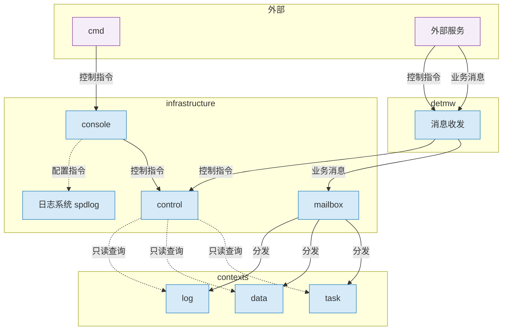

# dts-framework 重构设计（strategy 阶段）

> 模式：重构（来自 iso-output.md）· 目录：`/home/guang/code/dts-framework`
> 更新：2026-08-04 · 进度：6.1 分层图定稿，进入 bootstrap 重构方案

## 1. 需求边界（来自 iso-output.md）

| ID | 需求 | 状态 |
|----|------|------|
| R1 | 五层 API 重写：detmw / detsched / infrastructure / task·data·log / bootstrap | ✅ |
| R2 | 可读性达标：可 review、无 AI 坏味道、单文件职责单一 | ✅ |
| R3 | 行为不回归：cpf/dpf 压测一致 | ✅ |
| R4 | console 运维通道：内置 + 命令表驱动 + 每实例 socket | ✅ |
| R5 | detmw 控制通道：外部服务 DDS 控制消息 → control 线程 | ✅ |
| R6-R8 | 三方库不动 / 动态 EDP / 编译宏差分 CPF·DPF·BPF·BB | ✅ |

## 2. 6.1 分层架构图（定稿）



**要点**：
- 外部两入口：`cmd`（人类运维，socket 登录）、`外部服务`（业务消息 + 控制指令，DDS）
- 进程内：detmw 收业务消息 → mailbox → 业务线程；控制指令 → control 线程
- console 收 cmd → 控制指令（投 control）+ 配置指令（spdlog）
- control 线程只读查询各业务线程，不阻塞业务

## 3. 关键决策记录（已确认）

| # | 决策 | 理由 |
|---|------|------|
| D1 | console 内置进程（非独立工具） | docker 编排/版本/命令增删改集中一个二进制 |
| D2 | 外部服务控制走 detmw DDS 控制通道（独立 session/msgId） | 统一入口，业务/控制分离 |
| D3 | 命令执行一处 CommandExecutor；传输两条（socket/DDS） | 命令定义/版本只在单处 |
| D4 | 多实例每实例一 socket（编译宏派生路径） | 编译期已差分独立二进制 |
| D5 | 运维命令不进业务线程 mailbox（只读查询） | 不阻塞业务热路径 |
| D6 | 调试指令（日志级别等）突发不加锁；外发版本 `DTS_CONSOLE_ENABLE` 裁剪 | spdlog::set_level 线程安全；生产不携带 |
| D7 | detmw 统一 DDS + 双通道：进程内直通 mailbox，进程外走 DDS | FastDDS 零拷贝要求 plain+bounded，字节流（sequence<octet>）不满足，DDS 无法免序列化；接收侧本就全走 mailbox，直通不新增接收代码 |
| D8 | 双 API：`mw_publish`（进程外 DDS）/ `mw_publish_inner`（进程内 mailbox 直通）；调用方直接选，运行时零查表 | 降低路由负担：发送侧不做"本地/外部"映射判断，负担移到编码期 |

## 4. detmw 双通道设计（2026-08-04 定稿）

**背景**：task/data/log 同进程线程间消息，若走 DDS 需序列化（memcpy 两份）；FastDDS 零拷贝（DataSharing loan）要求 plain+bounded 类型，而字节流 `sequence<octet>` 不满足（官方明确不支持），同 participant 直通也仍过 serialize。故进程内消息不走 DDS。

**关键洞察**：DDS 消息本就投递到线程 mailbox（`OnRouteMsg → mailbox.Send`），接收侧从来就是 mailbox。进程内直通 = 发送侧直接 `mailbox.Send`，接收侧零改动。

**API 分开**（调用方直接选通道，运行时零查表）：
```cpp
// 进程外：走 DDS（外部 nfoam 等），序列化 + SHM/UDP 传输
int mw_publish(const char* sessionType, const char* sessionInst, uint32_t msgId,
               const uint8_t* data, uint32_t len);
// 进程内：线程直通，直接 mailbox.Send（task→data 等本地线程），免序列化
int mw_publish_inner(uint32_t msgId, const uint8_t* data, uint32_t len);
```

**接收侧**：所有消息进线程 mailbox，`ThreadRun` 消费，不区分来源（DDS / 直通）。

## 5. 下一步：bootstrap 重构（进行中，已落地 + 验证通过）
